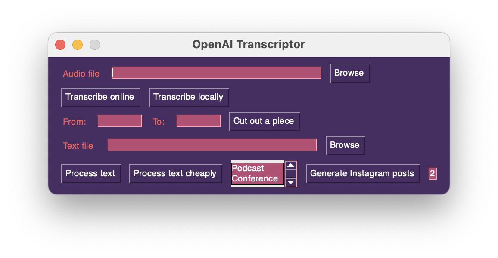

# Audio Text Processor

Tool for processing audio files and generating transcriptions or text-based content derived from audio input 
## Features

- **Transcription**: Converts speech in audio files to text using [Whisper](https://openai.com/research/whisper)
- **Text Processing**: Processes text to generate more refined and structured outputs, such as articles and social media posts
- **Audio trimming**: Allows cutting specific segments from an audio file

## Requirements
- [ffmpeg](https://ffmpeg.org)
- Python 3.11
- [PySimpleGUI license](https://www.pysimplegui.com/pricing)
- [Whisper](https://github.com/openai/whisper)
  - *~10 GB VRAM for **local transcription***

## Installation

1. **Install Dependencies**
   ```
   pip install -r requirements.txt
   ```
2. Set up the [`.env`](.env.example) with [OpenAI API key](https://platform.openai.com/api-keys)

## Usage

### Running the Main Script
```bash
python3.11 main.py
```


### Transcribing Audio
1. Choose an `Audio file`
2. Select if audio is  a `Podcast` (monologue) or a `Conference` (group discussion)
3. Select the transcription mode
   * Online - using [OpenAI's Whisper](https://openai.com/pricing#audio-models)
   * Local - using OpenAI's [large Whisper](https://github.com/openai/whisper?tab=readme-ov-file#available-models-and-languages) model on device

For larger audio files there will be multiple `.txt` outputs that will overlap for later consolidation

### Processing transcript
1. Choose a `Text file`
2. Select if transcription is of a `Podcast` (monologue) or a `Conference` (group discussion)
3. Select the processing mode
   * Regular - [GPT-4](https://openai.com/pricing#gpt-4)
   * Cheap - [GPT-3.5 Turbo](https://openai.com/pricing#gpt-3-5-turbo)

The final output is a whole processed meaningfully structured text without speech defects
For larger transcripts there will be multiple intermediate `.txt` outputs that can later be re-processed separately


### Cutting Audio
1. Choose an `Audio file`
2. Enter start `From` and end `To` points to cut a piece from the audio file in `hh:mm:ss`, `mm:ss` or `ss` format
3. ✨Cut out a piece

It will be automatically converted to `.mp3`

### Generating Posts
Intended for use with Podcasts.
Utilises [GPT-4 Turbo](https://help.openai.com/en/articles/8555510-gpt-4-turbo-in-the-openai-api) with its large context window. Limited output is perfect for posts
1. Choose a `Text file`. *I recommend choosing full original transcript*
2. Enter the number of post variations. *Defaults to 2*
3. ✨Generate posts


## Modules

- **textprocessorai.py**: Contains the `TextProcessor` class which manages text files, tokenization, and processing of complete texts.
- **aicompatableaudio.py**: Handles audio files and their paths, including conversion to supported format, splitting large files into supported sized segments


----
Adjust [prompts](prompts.py) if necessary

Once any processing starts the program will become unresponsive until finished. That is done to limit simultaneous requests
